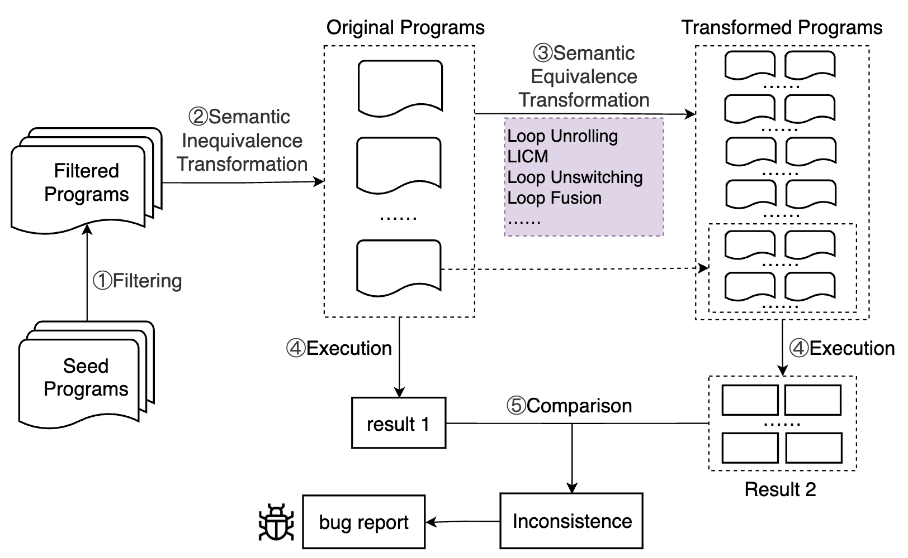

# Optimization Testing
Our approach leverages tailored code construction strategies to generate input programs that meet optimization conditions. Subsequently, it applies various compiler optimization transformations to produce semantically equivalent test programs. By comparing the outputs of the pre- and post-transformation programs, this method effectively identifies incorrect optimization bugs. The detailed process is illustrated in the figure below. 



By default, we uses Csmith to produce seed programs. 

# Structure of the project

```
Core operations is under the main folder:
|-- AST_Information # The AST analysis implementation directory
|-- genMutate # The mutate generation execution directory
|-- mutations # The tailored code genertion strategies and mutate implementation directory target different optimizations
|-- csmith # The seed program generation implementation directory using Csmith
| |-- SwarmGen.java  # Updating configurations of Csmith
|-- RespectfulTestResult # The programs testing execution and their results comparison implementation directory
|-- ObjectOperation # The common operations targeted different datatype
|-- common # The common information extraction functions across overall process
|-- Overall # The overall testing process execution implemention directory
| |-- Main.java  # The entrance of overall testing
|-- processtimer # The process dealing and real-time memory check implemention directory
|-- sanitizer # The undefined behaviour filtering implemention directory
```

# Usage

### Step 1: Install necessary packages

- Ubuntu >= 20
- Java >= 17
- Csmith (Please install it following [Csmith](https://github.com/csmith-project/csmith))
- CSMITH_HOME: After installing Csmith, please set the environment variable `CSMITH_HOME` to the installation path, with which we can locate `$CSMITH_HOME/include/csmith.h`.
- add file `libsigar-amd64-linux.so` into `/usr/lib` and `/usr/lib64`

### Step 2: Run
Open this project using `eclipse` or `idea`, and run the `Main.java` in the `/src/Overall`.


